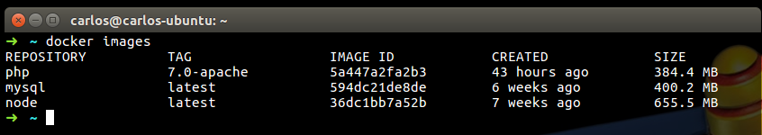

#What is Docker?
Docker is a software containerization platform, a tool designed 
to make it easier to create, deploy and run applications by using containers
#Installing Docker
Go to the official website, choose your SO and follow the [installation instructions][1]
Don't forget the [Post-installation steps for Linux][2] and follow only the `Manage Docker as a non-root user` section.
#### Verify your Installation
Open a command-line terminal, and run the follow Docker command to verify the Docker is installed.

```shell
docker --version
```
You should see something lke this:
```shell
Docker version 1.12.5, build 7392c3b
```

##What is a Image?
An image is an inert, immutable, file that's essentially a snapshot of a container. 
Images are created with the build command, and they'll produce a container when started with run.
Images are stored in a Docker registry such as [registry.hub.docker.com][3]. 
 
###What is Docker Registry?
The Registry is a stateless, highly scalable server side application that stores 
and lets you distribute Docker images. The Registry is open-source, under the permissive Apache license.

##The Brief
We are going to build a micro service which let us to manage different users using APACHE2, PHP7 and MYSQL.

##Downloading our first image
We need to install Apache2 and PHP7 to get start with the development.
Go to 'Explore Repositories' in Docker Hub and select the php repository.

 <p align="center">
   
 </p>

Lets download our first image that contains PHP7 with Apache2 from the Docker Hub.
Run the following command: `docker pull php:7.0-apache` to pull the image.

To see our docker images only run: `docker images` and this gives the following output:
 <p align="center">
   
 </p>

In my case I've downloaded 3 images.

Now you are probably asking how you can start using this Php7-apache image on a real project.
Please see the next section [Running Images with Docker][4]


[1]: https://docs.docker.com/compose/overview/
[2]: https://docs.docker.com/engine/installation/linux/linux-postinstall/
[3]: https://hub.docker.com/
[4]: https://github.com/CarlitosDroid/docker-basics-tutorial/tree/container