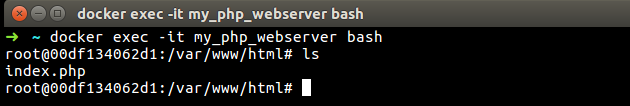

#What is Docker Container?
Docker container allow a developer to package up an application with all of the parts it needs,
such as libraries and other dependencies and ship it all out as one package.
Docker container wrap a piece of software in a complete filesystem that contains everything needed
to run: code runtime, system tools, systems libraries, anything that can be installed on a server.
This guarantees that the software will always run the same, regardless of its environment.

###Working with containers
Don't forget that the official documentation for the php:7.0-apache Docker image is fundamental, 
is something that you should look at. In fact make it a habit to go through the documentation page 
for each image that you try, it will give you a clear instructions on how to run it and other configuration
details.

To make the default php7.0 and apache run in a container, all we need to do is the following:
```shell
docker run -d --name my_php_webserver -p 80:80 php:7.0-apache
```
###Some useful options to the docker run command are:
`-d` this parameter will run the container in Detached mode.
`--name` a name for our container.
`-p` will publish/expose ports for our container (HostPort:ContainerPort).
`-v` mounts a volume to share between host and container.
`-it` attaches an interactive tty in the container.
`stop` stop the running container.
`rm` remove the container after running.

 <p align="center">
   
 </p>

Now, let us check if the Container is running. To do that we'll use our familiar docker ps
command as shown below
####Listing only running containers
```shell
docker ps 
```
####Listing All Containers
```shell
docker ps -a
```

And we should see something like this:
 <p align="center">
   
 </p>
 
And now if we point our browser to [localhost][1] we'll see apache web server in action. 
 
 <p align="center">
    
 </p>
 
The image above is shown because we don't have any php file in the `/var/www/html` path inside our container,
 we need to add some php project in that path to see our work in action. 

###Exploring our container
```shell
docker exec -it my_php_webserver bash
```
Using the command above we'll browse inside the container and we can see that `/var/www/html` 
is empty clearly.

###Adding any file inside a container
We have two ways to create o add some file or folder inside a container:
####Creating a file inside the container
After using the `docker exec ...` command line above and inside our container, we can install 
```shell
#update the ubuntu apt package manager
apt-get update
#install vim editor
apt-get install vim
```
And now you can create any php file in the `/var/www/html` path, in my case I've created a simple `index.php` 
file:
 <p align="center">
     
 </p>
 And point your browser to localhost again:
 <p align="center">
      
 </p>

####Copying a file from host inside container 


[1]: http://localhost/